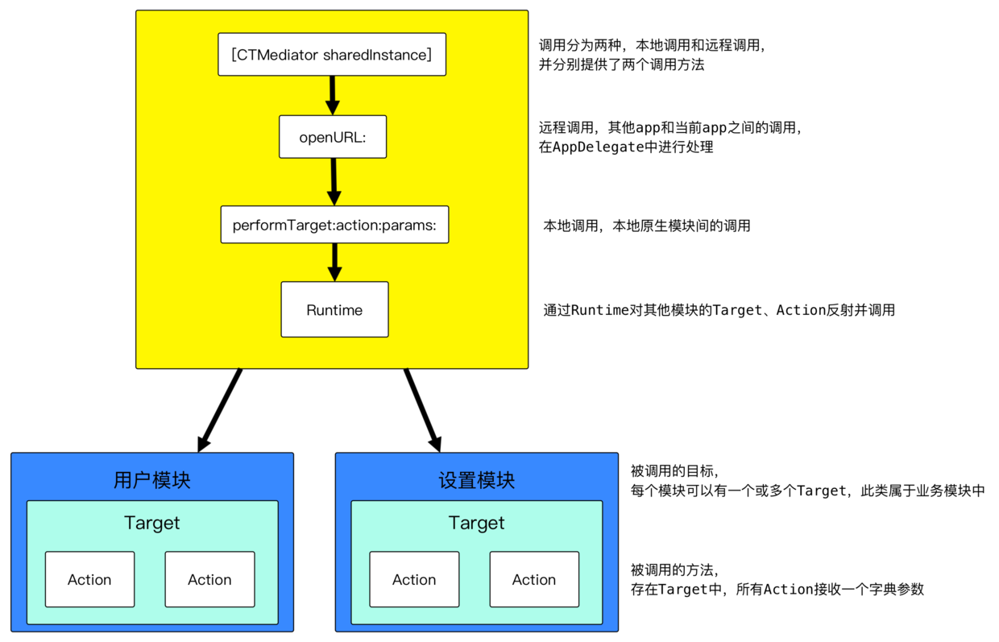

# 组件化原理和应用

- [组件化原理和应用](#%E7%BB%84%E4%BB%B6%E5%8C%96%E5%8E%9F%E7%90%86%E5%92%8C%E5%BA%94%E7%94%A8)
  - [为什么需要组件化](#%E4%B8%BA%E4%BB%80%E4%B9%88%E9%9C%80%E8%A6%81%E7%BB%84%E4%BB%B6%E5%8C%96)
  - [组件化的过程](#%E7%BB%84%E4%BB%B6%E5%8C%96%E7%9A%84%E8%BF%87%E7%A8%8B)
    - [方案一、url-block](#%E6%96%B9%E6%A1%88%E4%B8%80url-block)
    - [方案二、protocol-class](#%E6%96%B9%E6%A1%88%E4%BA%8Cprotocol-class)
    - [方案三、target-action](#%E6%96%B9%E6%A1%88%E4%B8%89target-action)
  - [组件化实施的方式](#%E7%BB%84%E4%BB%B6%E5%8C%96%E5%AE%9E%E6%96%BD%E7%9A%84%E6%96%B9%E5%BC%8F)
  - [总结](#%E6%80%BB%E7%BB%93)
  - [参考资料](#%E5%8F%82%E8%80%83%E8%B5%84%E6%96%99)

## 为什么需要组件化
随着公司业务的不断发展，项目的功能越来越复杂，各个业务代码耦合也越来越多，代码量也是急剧增加，传统的MVC或者MVVM架构已经无法高效的管理工程代码，因此需要用一种技术来更好地管理工程，而组件化是一种能够解决代码耦合的技术。项目经过组件化的拆分，不仅可以解决代码耦合的问题，还可以增强代码的复用性，工程的易管理性等等。

## 组件化的过程

大致有三种，下面分别介绍各自的实现过程：

### 方案一、url-block

这是蘑菇街中应用的一种页面间调用的方式，通过在启动时注册组件提供的服务，把调用组件使用的url和组件提供的服务block对应起来，保存到内存中。在使用组件的服务时，通过url找到对应的block，然后获取服务。

下图是url-block的架构图：

注册：

    [MGJRouter registerURLPattern:@"mgj://detail?id=:id" toHandler:^(NSDictionary *routerParameters) {
        NSNumber *id = routerParameters[@"id"];
        // create view controller with id
        // push view controller
    }];

调用：

    [MGJRouter openURL:@"mgj://detail?id=404"]

蘑菇街为了统一iOS和Android的平台差异性，专门用后台来管理url，然后针对不同的平台，生成不同类型的文件，来方便使用。

使用url-block的方案的确可以组建间的解耦，但是还是存在其它明显的问题，比如：

需要在内存中维护url-block的表，组件多了可能会有内存问题
url的参数传递受到限制，只能传递常规的字符串参数，无法传递非常规参数，如UIImage、NSData等类型
没有区分本地调用和远程调用的情况，尤其是远程调用，会因为url参数受限，导致一些功能受限
组件本身依赖了中间件，且分散注册使的耦合较多

### 方案二、protocol-class

针对方案一的问题，蘑菇街又提出了另一种组件化的方案，就是通过protocol定义服务接口，组件通过实现该接口来提供接口定义的服务，具体实现就是把protocol和class做一个映射，同时在内存中保存一张映射表，使用的时候，就通过protocol找到对应的class来获取需要的服务。

下图是protocol-class的架构图：

图2

注册：

    [ModuleManager registerClass:ClassA forProtocol:ProtocolA]

调用：

    [ModuleManager classForProtocol:ProtocolA]

蘑菇街的这种方案确实解决了方案一中无法传递非常规参数的问题，使得组件间的调用更为方便，但是它依然没有解决组件依赖中间件的问题、内存中维护映射表的问题、组件的分散调用的问题。设计思想和方案一类似，都是通过给组件加了一层wrapper，然后给使用者调用。

同时，另一种方案是url-controller，这是LDBusMediator的组件化方案，我认为和方案二的实现原理类似。它是通过组件实现公共协议的服务，来对外提供服务。具体就是通过单例来维护url-controller的映射关系表，根据调用者的url，以及提供的参数（字典类型，所以参数类型不受约束）来返回对应的controller来提供服务；同时，为了增强组件提供服务的多样性，又通过服务协议定义了其它的服务。整体来看，LDBusMediator解决了蘑菇街的这两种组件化方案的不足，比如：通过注册封装件connector而不是block来降低了内存占用；通过字典传递参数，解决了url参数的限制性。但是，由于使用了connector来提供服务而不是组件本身，把connector作为组件的一部分，依然有组件依赖中间件的问题。

下图是LDBusMediator的组件化架构图：

图3

### 方案三、target-action

casa的方案是通过给组件包装一层wrapper来给外界提供服务，然后调用者通过依赖中间件来使用服务；其中，中间件是通过runtime来调用组件的服务，是真正意义上的解耦，也是该方案最核心的地方。具体实施过程是给组件封装一层target对象来对外提供服务，不会对原来组件造成入侵；然后，通过实现中间件的category来提供服务给调用者，这样使用者只需要依赖中间件，而组件则不需要依赖中间件。

下图是casa的组件化方案架构图：

图4

以下代码来自casa的组件化demo

target

A组件

    // TargetA.h
    - (UIViewController *)Action_nativeFetchDetailViewController:(NSDictionary *)params;
  
CTMediator分类

    // CTMediator+CTMediatorModuleAActions.h

    - (UIViewController *)CTMediator_viewControllerForDetail;

    // CTMediator+CTMediatorModuleAActions.m

    - (UIViewController *)CTMediator_viewControllerForDetail
    {
        return [self performTarget:kCTMediatorTargetA action:kCTMediatorActionNativFetchDetailViewController params:@{@"key":@"value"} shouldCacheTarget:NO];
    }

调用

    // ViewController.h
    #import "CTMediator+CTMediatorModuleAActions.h"
    [self presentViewController:[[CTMediator sharedInstance] CTMediator_viewControllerForDetail] animated:YES completion:nil];
从以上代码可以看出，使用者只需要依赖中间件，而中间件又不依赖组件，这是真正意义上的解耦。但是casa的这个方案有个问题就是hardcode，在中间件的category里有hardcode，casa的解释是在组件间调用时，最好是去model化，所以不可避免的引入了hardcode，并且所有的hardcode只存在于分类中。针对这个问题，有人提议，把所有的model做成组件化下沉，然后让所有的组件都可以自由的访问model，不过在我看来，这种方案虽然解决了组件间传递model的依赖问题，但是为了解决这个小问题，直接把整个model层组件化后暴露给所有组件，容易造成数据泄露，付出的代价有点大。针对这个问题，经过和网友讨论，一致觉得组件间调用时用字典传递数据，组件内调用时用model传递数据，这样即减少组件间数据对model的耦合，又方便了组件内使用model传递数据的便捷性。

## 组件化实施的方式
组件化可以利用git的源代码管理工具的便利性来实施，具体就是建立一个项目工程的私有化仓库，然后把各个组件的podspec上传到私有仓库，在需要用到组件时，直接从仓库里面取。

1. 封装公共库和基础UI库

在具体的项目开发过程中，我们常会用到三方库和自己封装的UI库，我们可以把这些库封装成组件，然后在项目里用pod进行管理。其中，针对三方库，最好再封装一层，使我们的项目部直接依赖三方库，方便后续开发过程中的更换。

2. 独立业务模块化

在开发过程中，对一些独立的模块，如：登录模块、账户模块等等，也可以封装成组件，因为这些组件是项目强依赖的，调用的频次比较多。另外，在拆分组件化的过程中，拆分的粒度要合适，尽量做到组件的独立性。同时，组件化是一个渐进的过程，不可能把一个完整的工程一下子全部组件化，要分步进行，通过不停的迭代，来最终实现项目的组件化。

 3. 服务接口最小化

在前两步都完成的情况下，我们可以根据组件被调用的需求来抽象出组件对外的最小化接口。这时，就可以选择具体应用哪种组件化方案来实施组件化了。

## 总结
组件化是项目架构层面的技术，不是所有项目都适合组件化，组件化一般针对的是大中型的项目，并且是多人开发。如果，项目比较小，开发人员比较少，确实不太适合组件化，因为这时的组件化可能带来的不是便捷，而是增加了开发的工作量。另外，组件化过程也要考虑团队的情况，总之，根据目前项目的情况作出最合适的技术选型。我一直尊崇，没有最好的技术，只有最合适的技术。

## 参考资料

+ [LDBusMediator](https://github.com/Lede-Inc/LDBusMediator.git)
+ [CTMediator](https://github.com/casatwy/CTMediator.git)
+ [iOS-Component-Pro](https://github.com/guangqiang-liu/iOS-Component-Pro)
+ [阿里的BeeHive](https://github.com/alibaba/BeeHive/blob/master/README-CN.md)
+ [MGJRouter](https://github.com/meili/MGJRouter)